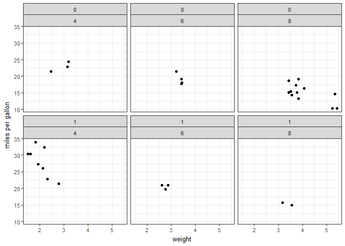
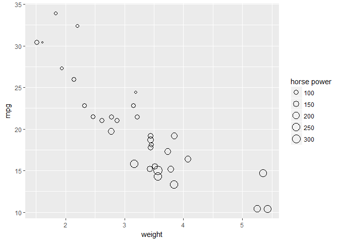

README
================
Adam Ziada
December 6, 2016

Introduction
------------

This package has been inspired by my research group and there desire to make awesome graphs without really knowing much about R. In this package I will be introducing three new funcitons, one that allows you to make a simple heatmap, another that lets you copare 2 continous variables and facet over anothe 2 categorical variables, and a 3rd that allows you to compare 3 continous variables by mapping the 3rd variable to the size of the data points.

heatmap()
---------

To use this function you must pre-prepare a table or else it won't. The term used in this pkg is the "summarized data table", which means for your two catigorical variables, you should have only one row in your table for each combination of catigorical variables, with one y output for each row. For example, if you want to see the effect of sex (male vs female) and smoking status (yes vs no), and you want to measure mutation rate accross 100 samples, you would prepare a table with 3 columns and 4 rows. Note that we have averaged the mutation for each of the 4 combinations of sex and smoking.

| sex      | smoking | average mutation rate |
|----------|---------|-----------------------|
| "male"   | "no"    | 15.5                  |
| "male"   | "yes"   | 12.3                  |
| "female" | "no"    | 18.8                  |
| "female" | "yes"   | 15.6                  |

### Function structure

heatmap(data, x1, x2, y, xlab = "x-axis", ylab = "y-axis", legendlab = "responsevariable")

-   data is a summarized data frame with 2 factor variables and 1 continous variable
-   x1 is a column of a data frame of the form data$variable name, that must contain summarized factor data.
-   x2 is a column of a data frame of the form data$variable name, that must contain summarized factor data.
-   y is a column of a data frame of the form data$variable name, that must contain summarized (double, integer, or numeric) data.
-   xlab is the x-axis label - must be character data.
-   ylab is the y-axis label - must be character data.
-   legendlab is the legend label - must be character data.

### Example

In this package we use the mtcars data set a lot, and below I'm going to walk through and example of how to use the heatmap function. First we need to fix the mtcars data, as several of the categorical variables are encoded as factors.

``` r
    my_cars <- dplyr::mutate(mtcars, cyl = as.factor(mtcars$cyl),
                                                     gear = as.factor(mtcars$gear),
                                                     carb = as.factor(mtcars$carb),
                                                     am = as.factor(mtcars$am),
                                                     vs = as.factor(mtcars$vs))

str(my_cars)
```

    ## 'data.frame':    32 obs. of  11 variables:
    ##  $ mpg : num  21 21 22.8 21.4 18.7 18.1 14.3 24.4 22.8 19.2 ...
    ##  $ cyl : Factor w/ 3 levels "4","6","8": 2 2 1 2 3 2 3 1 1 2 ...
    ##  $ disp: num  160 160 108 258 360 ...
    ##  $ hp  : num  110 110 93 110 175 105 245 62 95 123 ...
    ##  $ drat: num  3.9 3.9 3.85 3.08 3.15 2.76 3.21 3.69 3.92 3.92 ...
    ##  $ wt  : num  2.62 2.88 2.32 3.21 3.44 ...
    ##  $ qsec: num  16.5 17 18.6 19.4 17 ...
    ##  $ vs  : Factor w/ 2 levels "0","1": 1 1 2 2 1 2 1 2 2 2 ...
    ##  $ am  : Factor w/ 2 levels "0","1": 2 2 2 1 1 1 1 1 1 1 ...
    ##  $ gear: Factor w/ 3 levels "3","4","5": 2 2 2 1 1 1 1 2 2 2 ...
    ##  $ carb: Factor w/ 6 levels "1","2","3","4",..: 4 4 1 1 2 1 4 2 2 4 ...

Now we want to group the data by number of cylinders (cyl) and weather they are automatic or manual (am), and take the average of the miles per gallon, which will be our response varialbe in this case.

``` r
    heat_data <- dplyr::ungroup(
        dplyr::summarise(dplyr::group_by(my_cars, am, cyl),
                                         average_mpg = mean(mpg)))

heat_data
```

    ## # A tibble: 6 × 3
    ##       am    cyl average_mpg
    ##   <fctr> <fctr>       <dbl>
    ## 1      0      4    22.90000
    ## 2      0      6    19.12500
    ## 3      0      8    15.05000
    ## 4      1      4    28.07500
    ## 5      1      6    20.56667
    ## 6      1      8    15.40000

Now this data can be feed into our function heatmap()

``` r
#heatmap::heatmap(heat_data, heat_data$cyl, heat_data$am, heat_data$average_mpg, "cylinders", "am", "mpg")
```

Note that for some reason this call will not work in rmarkdown, however entering the exact same code into my consol after a build and reload produces the below graph, which I saved as a png, put on git hub and linked to below.


facet2D()
---------

This function was inspired by my interested in showing 2 categorical variables in the same set of graphs as 2 continous variables, ploting a grid of faceted plots where each column represents different values of one categorical variable, and each row represents different values of the other categorical variable. Each plot would show one of the continous variables on the x axis, with the other continous variable on the y-axis. However at this moment the function is not working properly. I will go into that below.

### Function Structure

facet2D(data, c1, c2, f1, f2, xlab = "x-axis", ylab = "y-axis")

-   data is a data frame
-   c1 is a column of a data frame of the form data$variable name, containing int, dbl, or numeric data
-   c2 is a column of a data frame of the form data$variable name, containing int, dbl, or numeric data
-   f1 is a column of a data frame of the form 'variable' name, containing factor data. Note that you must put the name of the variable in quotes when entering it into the function.
-   f2 is a column of a data frame of the form 'variable' name, containing factor data. Note that you must put the name of the variable in quotes when entering it into the function.
-   xlab is the x-axis label - must be character data.
-   ylab is the y-axis label - must be character data.

### Trouble shooting

In this graph, I want to compare the mpg or miles per gallon a car gets based on it's weight, accross cars with different numbers of cylinders and automatic drive vs manual drive. Below is the guts of what the function does.

``` r
b <- ggplot2::ggplot(my_cars, ggplot2::aes(wt, mpg)) +
        ggplot2::geom_point(alpha = 1) +
        ggplot2::facet_wrap(c(paste("am"), paste("cyl"))) +
        ggplot2::labs(x = "weight") +
        ggplot2::labs(y = "miles per gallon") +
        ggplot2::theme_bw(base_size = 10)
b
```


Unfortunatly when we make pretty much an identical call to our function, something about the facet\_wrap distorts the data.

``` r
coolgraph::facet2D(my_cars, my_cars$wt, my_cars$mpg, "am", "cyl", "weight", "miles per gallon")
```



Note that all tests for this function are currently disabled until it is working properlly. As you can see, it technically facet's the data and plots mpg vs wt, but something seems to be going wrong in that the points are distorted. This function will hopefully be fixed at a future data.

sizescale()
-----------

This function is directly inspired by my lab's request to plot 3 continous variables on one graph, as such this function plots one variable on the x axis, one variable on the y axis, and maps on variable to the size of each point, which is drawn as an outline to reduce cluttering of the data.

### Function structure

sizescale(data, x1, y1, scale, xlab = "x-axis", ylab = "y-axis", legendlab = "legend")

-   data is a data frame
-   x1 is a column of a data frame of the form data$variable name, containing int, dbl, or numeric data
-   y1 is a column of a data frame of the form data$variable name, containing int, dbl, or numeric data
-   scale is a column of a data frame of the form data$variable name, containing int, dbl, or numeric data
-   xlab is the x-axis label - must be character data.
-   ylab is the y-axis label - must be character data.
-   legendlab is the legend label - must be character data.

### Example

This function will work pretty much directly on any dataframe, and requires minimal prep, however if for some reason your continous variables aren't in a numerical formate (dbl, int, numeric) then you will have to convert them to said numeric formate.

Below is the internal workings of the function.

``` r
ggplot2::ggplot(mtcars, ggplot2::aes(x = mtcars$wt, y = mtcars$mpg)) +
        ggplot2::geom_point(ggplot2::aes(size= mtcars$hp), pch = 21) +
        ggplot2::xlab("weight") +
        ggplot2::ylab("mpg") +
        ggplot2::labs(size = "horse power")
```


And again, below this the actual function call.

``` r
coolgraph::sizescale(mtcars, mtcars$wt, mtcars$mpg, mtcars$hp, "weight", "mpg", "horse power")
```



As you can see it seems to work more or less as intended. This function is both the simplest function in the package, and the most well behaved.
